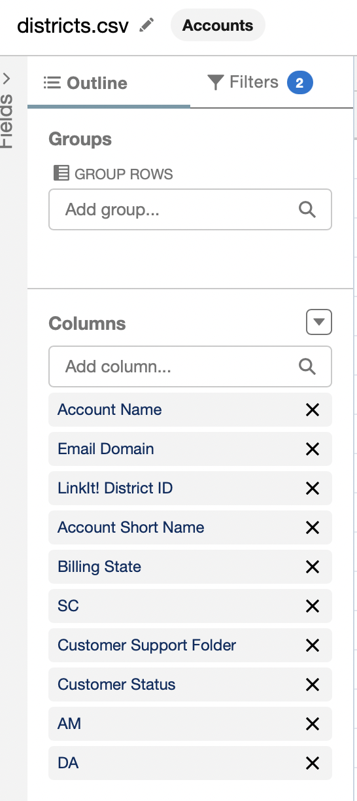
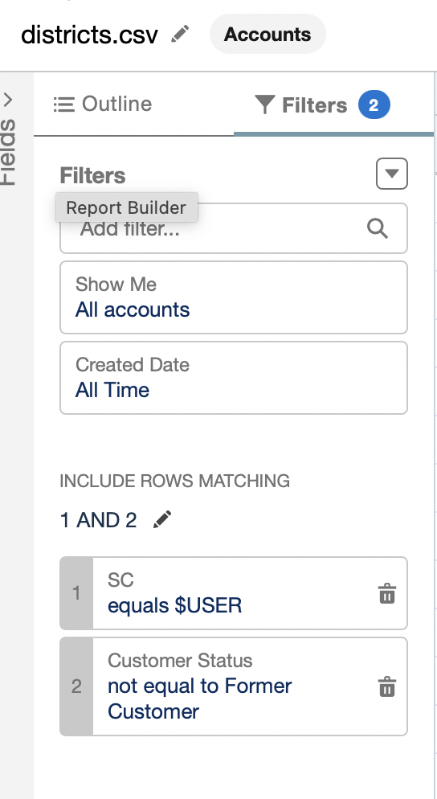

# LinkOps CLI Tool

`LinkOps` is a versatile command-line interface (CLI) tool designed to streamline operations for the LinkIt! Solution Center. It integrates binary executables, scripts, and utility functions into a unified, easy-to-use command structure.

## Features

- **Execute Binaries**: Dynamically executes files from the `/bin` directory by name.
- **Copy SQL Scripts**: Quickly copy SQL files from the `/scripts/sql` directory to your clipboard for use in tools like SSMS.
- **Run Python Scripts**: Execute Python scripts from the `/scripts/python` directory with ease.
- **List Files**: Display all files in the repository for quick reference.
---

## Installation

1. Clone the repository:
   ```bash
   git clone https://github.com/jack-linkit/linkitenv.git
   cd linkops
   ```

2. Make the CLI executable:
    ```bash
    chmod +x linkops
    ```

3. (Optional) Add the CLI to your PATH
    ```bash
    export PATH="$PATH:$(pwd)"
    ```
4. Download your districts.csv reference export from SalesForce and place it in the `/data` folder
<p>
  
  
</p>

## Usage

### General Command Format
```bash
./linkops <command> [arguments]
```
### Available Commands

#### 1. Execute a Binary
Runs a binary file from the /bin directory by name
```bash
./linkops <binary_name> [arguments]
```
##### Currently available binaries
- `amlookup`
- `clinerep`
- `cuid`
- `dalookup`
- `ddomain`
- `ddrive`
- `dlookup`
- `isearch`
- `linerep`
- `openurl` (*zsh only*)
- `sftp-connect` 

Any commands ending in `lookup` search the *data/districts.csv* file

